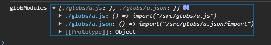
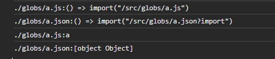

# Vite 高级应用

### HMR 热更新
 

### glob import 
 - 全局导入
``` js
创建一个全局文件夹globs，往里面添加点文件。 
// 导入全局文件夹
const globModules = import.meta.glob('./globs/*')
console.log("globModules",globModules)
// 输出结果是一个以 文件路径为键。import函数 为 值


``` 
- 输出结果
- 


### 引入文件
```ts
// 遍历 globModules 
Object.entries(globModules).forEach(([k,v])=>{
    console.log(k + ":" + v) 
    v().then(mod => {
        console.log(k+":" +mod.default)
    })
})

```
- 输出结果
- 
